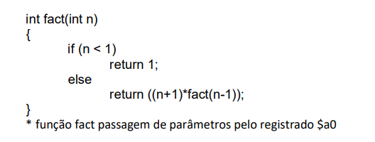

# AssemblyRecursion
Repositório para registro de atividade sobre recursão em Assembly, da matéria de Organização e Arquitetura de Computadores II

### Descrição
Este projeto busca registrar a solução de um exercício da matéria de Organização e Arquitetura de Computadores II. Trata-se de um exercício que aborda o uso de funções recursivas em um cálculo alternativo e modificado de fatoriais.

### Principais conceitos trabalhados no exercício:
- Uso e gerenciamento da pilha de memória
- Funções recursivas
- Preservação e restauração de variáveis entre chamadas recursivas

# Enunciado do exercício:
 Apresente a implementação em linguagem de máquina dos códigos abaixo

# Observações:
Este código simples tem como objetivo principal o estudo da recursão e de conceitos relacionados em Assembly MIPS. O código possui limitações devido à implementação do MARS, que utiliza instruções de 32 bits. Essas limitações, juntamente com a escolha das instruções básicas que compõem o programa, restringem o valor máximo de n a 11.

Para permitir o uso de valores maiores para n, seria necessário aprimorar o código. Isso poderia ser feito implementando manualmente a aritmética de 64 bits ou utilizando uma implementação diferente do MARS que suporte operações de maior precisão, possivelmente com bibliotecas adequadas para aritmética de precisão arbitrária.

